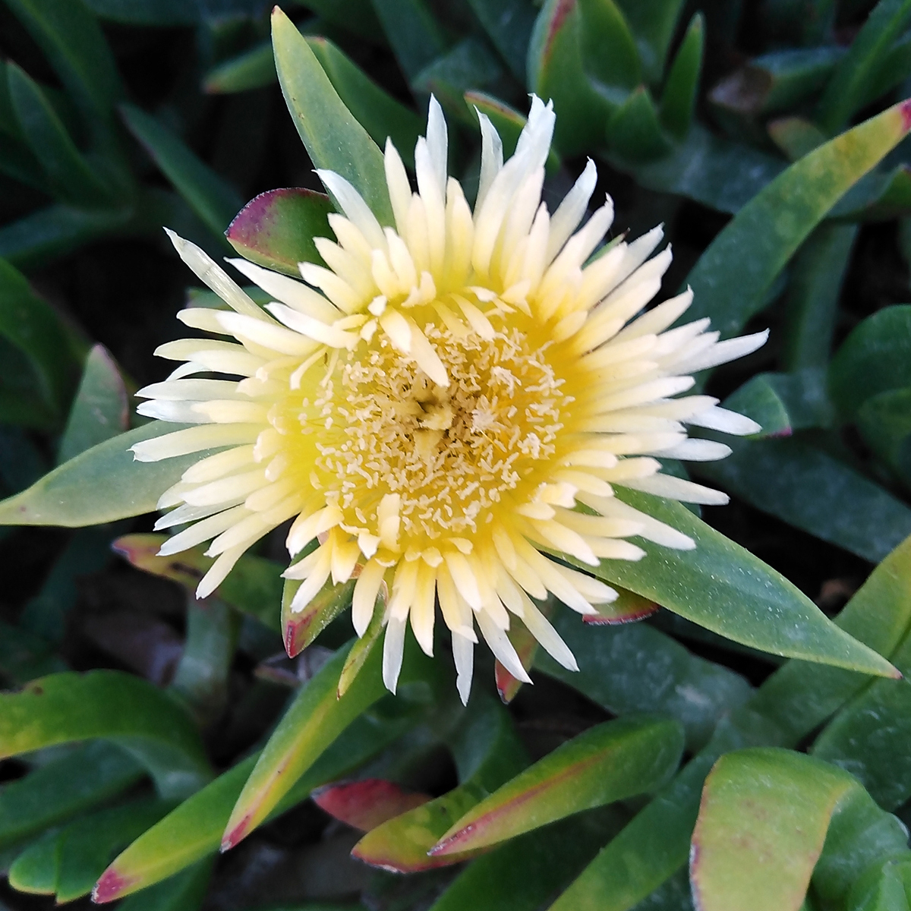

// add cover image to img directory and update filename below
ifdef::backend-html5[]

endif::backend-html5[]

== Colophon

=== Suggested citation

Figueira R, Beja P, Villaverde C, Vega M, Cezón K, Messina T, Archambeau A, Johaadien R, Endresen D & Escobar D (2020) Guidance for private companies to become data publishers through GBIF: Template document to support the internal authorization process to become a GBIF publisher. Copenhagen: GBIF Secretariat. https://doi.org/10.35035/doc-b8hq-me03

=== Authors

Rui Figueira, Pedro Beja, Cristina Villaverde, Miguel Vega, Katia Cezón, Tainan Messina, Anne-Sophie Archambeau, Rukaya Johaadien, Dag Endresen & Dairo Escobar

=== Contributors

James Joyce & Samuel Beckett of Trinity College, Dublin, contributed to this version of the document.

=== Licence

The document _Guidance for private companies to become data publishers through GBIF_ is licensed under https://creativecommons.org/licenses/by-sa/4.0[Creative Commons Attribution-ShareAlike 4.0 Unported License^].

=== Persistent URI

https://doi.org/10.35035/doc-b8hq-me03

=== Document control

Version 2.0, June 2020

This document is also available in https://#[Spanish], https://#[French] and https://#[Portuguese].

=== Abstract

This document is a contribution to the https://www.gbif.org/en/project/2Zik1tfJoh3C92ZslvhDIr/[OpenPSD project: Promoting publication and use of private-sector data on biodiversity^], a joint creation of the GBIF nodes of https://#[Spain], https://#[Portugal], https://#[Norway], https://#[France] and https://#[Colombia] and the companies https://#[EDP], https://#[CIBIO] and https://#[Asplan Viak], and co-funded by the GBIF Secretariat through its https://www.gbif.org/programme/82219/[Capacity Enhancement Support Programme^].

=== Cover image

// Caption. Credit, source, licence.
Western honey bee (_Apis mellifera_), Hardy County, Florida, United States. Photo 2018 thebugroomno2 via https://www.gbif.org/occurrence/1945467387[iNaturalist research-grade observations], licensed under http://creativecommons.org/licenses/by-nc/4.0/[CC BY-NC 4.0].
